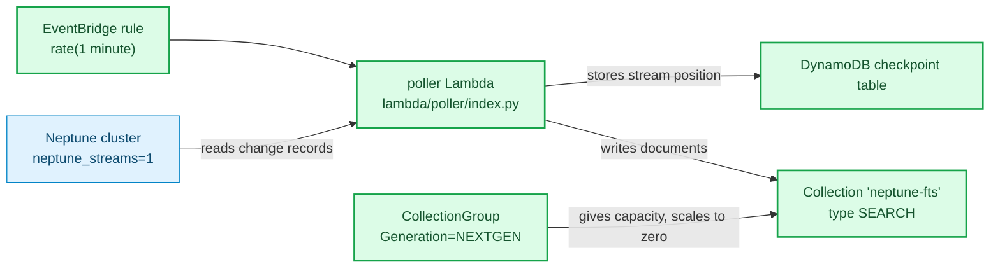

# Neptune to OpenSearch Serverless replication

<!--BEGIN STABILITY BANNER-->
---


> **This is a stable example. It should successfully build out of the box**
>
> This example is built on Construct Libraries marked "Stable" and does not have any infrastructure prerequisites to build.

---
<!--END STABILITY BANNER-->

Amazon Neptune can answer full-text search inside Gremlin and SPARQL queries by
keeping a copy of your graph in Amazon OpenSearch Service. AWS ships that
integration as a CloudFormation quick-start that targets a managed OpenSearch
domain. This example builds the same replication path in CDK, against an
**OpenSearch Serverless** collection on the **NextGen** architecture.

## What gets built

A Neptune cluster with streams turned on, an OpenSearch Serverless collection,
and a Lambda that copies changes from one to the other.



🟩 added · 🟦 context

Neptune writes every graph change to a log. The Lambda reads that log, writes
what it finds into the collection, and remembers where it stopped. Neptune then
searches the collection when a query asks for text.

## Why a Lambda on a timer

Neptune Streams is not a Lambda event source. DynamoDB Streams and Kinesis can
trigger a function directly; Neptune cannot. So something has to ask Neptune for
new records on a schedule, which is what the EventBridge rule and the poller do.

## Only one poller may run at a time

The stream is unsharded and strictly ordered, and every poller shares one
checkpoint row. Two pollers running together would interleave batches and rewind
each other's progress. Three things prevent that:

- **Reserved concurrency of 1.** Lambda refuses to start a second concurrent
  invocation. This is not billed, unlike provisioned concurrency.
- **A schedule longer than the timeout.** The rule fires every 5 minutes and the
  poller times out at 4, so a run cannot still be going when the next is due. An
  interval shorter than the runtime is the actual cause of overlap.
- **Compare-and-swap checkpoints.** The position is committed only if it has not
  moved since it was read. If a second writer ever did appear, it fails loudly
  instead of silently overwriting the marker.

Because the interval is long, the poller **drains in a loop** inside one
invocation rather than taking a single batch, stopping when it has used 90% of
its time budget or the stream runs dry. It commits after each batch, so a
timeout costs at most one batch of progress.

AWS's own streams-consumer solves this differently and more thoroughly: its
Lambda self-schedules through Step Functions and holds a DynamoDB lease, so the
next poll is caused by the previous one finishing rather than by a timer. That is
the design to copy for production; this example gets the same single-writer
guarantee with a schedule and a concurrency cap.

## Two requirements that are not optional

Both come from the Neptune user guide, and both are easy to miss.

**IAM authentication must be on.** Neptune clusters with IAM auth disabled are
not supported with OpenSearch Serverless. The stack sets `iamAuthentication:
true`, and the poller signs its stream reads because of it.

**The poller's role must be in the collection's data access policy.** An IAM
grant of `aoss:APIAccessAll` is only half of the permission. Collection data is
governed separately by a data access policy. Grant one without the other and the
poller authenticates, then gets refused. The stack creates both.

## NextGen specifics

`Generation: NEXTGEN` goes on the collection group, not on the collection. The
group is also where capacity lives, and the floor is set to 0 OCU for both
indexing and search. An idle collection therefore costs nothing for compute
after about ten minutes, and takes roughly ten seconds to answer the first
request after that.

NextGen collection endpoints live on `on.aws` and are reached through a
**standard** PrivateLink interface endpoint on the `com.amazonaws.<region>.aoss-data`
service, created through the EC2 API like any other service, with private DNS
enabled. This is not the same thing as the OpenSearch Serverless-managed VPC
endpoint (`AWS::OpenSearchServerless::VpcEndpoint`), which is the Classic path
and does not apply to a NextGen collection. Either kind of `vpce-` id is accepted
in the network policy's `SourceVPCEs`, so only the endpoint resource differs.

`TIMESERIES` collections are not supported on NextGen. This example uses
`SEARCH`, which is the right type for full-text search anyway.

## Signing: `aoss`, not `es`

The poller signs its OpenSearch writes for service name `aoss`. A managed domain
uses `es`. This is why the poller published with the AWS quick-start cannot be
pointed at a collection unchanged, and why this example ships its own.

## Deploy

```bash
npm install
npx cdk deploy
```

The stack takes roughly 15 minutes, most of it the Neptune cluster.

Three outputs matter:

- `CollectionEndpoint` -- set this as Neptune's full-text search endpoint.
- `NeptuneClusterEndpoint` -- where you load graph data.
- `NeptuneClusterResourceId` -- needed when you write IAM policies for Neptune
  data access.

## Querying

Neptune takes the OpenSearch endpoint **per query**, not as cluster
configuration. In Gremlin:

```groovy
g.withSideEffect("Neptune#fts.endpoint", "<CollectionEndpoint output>")
 .withSideEffect("Neptune#fts.queryType", "match")
 .V().has("city", "Neptune#fts dallas")
```

In SPARQL the equivalent is `neptune-fts:config neptune-fts:endpoint '<url>'`.

That has a consequence worth knowing: **the cluster itself calls the collection**,
so Neptune needs network reach to the collection's VPC endpoint, not just the
poller. The stack opens 443 to both. Grant it only to the poller and replication
works while every search query fails.

The IAM user or role you query Neptune with needs access to the collection too,
not just to Neptune:

```json
{
  "Version": "2012-10-17",
  "Statement": [
    {
      "Effect": "Allow",
      "Action": "aoss:APIAccessAll",
      "Resource": "arn:aws:aoss:<region>:<account>:collection/<collection-id>"
    }
  ]
}
```

`aoss:DashboardsAccessAll` is not needed here. It governs OpenSearch Dashboards
from a browser, and the two permissions work independently.

Everything runs in private subnets with no NAT gateway, so run queries from
inside the VPC.

## Things to know before you rely on this

**Existing data is not backfilled.** Replication starts from the point streams
were switched on. A cluster that already had data needs a one-time sync first,
or searches will miss whatever was written before. AWS publishes
[export-neptune-to-elasticsearch](https://github.com/awslabs/amazon-neptune-tools/tree/master/export-neptune-to-elasticsearch)
for that. Starting with an empty cluster, as this example does, avoids the
problem.

**Blank nodes are not replicated.** This is a documented limit of Neptune's
OpenSearch replication, not of this example.

**Recovering from an expired checkpoint.** Neptune purges change records after 7
days by default (`neptune_streams_expiry_days`, 1 to 90). If the poller is
stopped for longer than that, its stored position no longer exists in the stream
and Neptune answers with `ExpiredStreamException`. The poller raises
`ExpiredCheckpointError` for this specific case, because retrying cannot fix it.
AWS's documented recovery is a one-time re-sync:

1. Disable the EventBridge rule so the poller stops.
2. Delete the `amazon_neptune` index from the collection.
3. Clone the Neptune cluster.
4. Read the clone's stream with `iteratorType=LATEST` and note the `commitNum`
   and `opNum`.
5. Re-sync with
   [export-neptune-to-elasticsearch](https://github.com/awslabs/amazon-neptune-tools/tree/master/export-neptune-to-elasticsearch).
6. Write that position into the checkpoint table.
7. Re-enable the rule, then delete the clone.

**Availability is turned down for a demo.** The collection group sets
`standbyReplicas: DISABLED`, which removes the standby replicas in a second
Availability Zone. Data durability is unaffected, since everything is persisted
to the shared storage layer either way, but AZ-level availability is reduced.
AWS ships a Config rule (`opensearchserverless-collection-standbyreplicas-enabled`)
that reports a collection as NON_COMPLIANT in this state. Enable it for
production.

**The poller is a worked example, not the AWS production poller.** It handles the
common property-graph cases and is written to be read. AWS's streams-consumer
additionally provides Step Functions based recovery, a DynamoDB lease for
coordination, CloudWatch alarms on repeated poll failures, `StreamRecordsProcessed`
and `StreamLagTime` metrics with a dashboard, automatic OpenSearch index mapping
management, geo-location field mapping, non-string indexing controls, property and
datatype exclusion lists, and SPARQL record support. Take this as the wiring you
need and grow the handler to fit your data.

**No lag metric.** Replication lag is the number that matters operationally, and
nothing here publishes it. Add a `StreamLagTime` equivalent before relying on
this in anger.

**Cost.** The collection scales to zero, so an idle stack costs nothing for
search and indexing compute; you still pay for stored data. The Neptune cluster
does not scale to zero: an `r5.large` instance bills while the stack is up. Tear
it down when you are done.

## Teardown

```bash
npx cdk destroy
```

`deletionProtection` is off and the removal policy is `DESTROY` so the example
deletes cleanly. Neither setting belongs in a production cluster.

## Build and test

```bash
npm run build   # tsc
npm test        # jest assertions against the synthesized template
npx cdk synth
```

## Useful links

- [Full text search in Amazon Neptune using Amazon OpenSearch Service](https://docs.aws.amazon.com/neptune/latest/userguide/full-text-search.html)
- [Replication to OpenSearch Serverless](https://docs.aws.amazon.com/neptune/latest/userguide/full-text-search-serverless.html)
- [Data access control for Amazon OpenSearch Serverless](https://docs.aws.amazon.com/opensearch-service/latest/developerguide/serverless-data-access.html)
- [Neptune data model for OpenSearch data](https://docs.aws.amazon.com/neptune/latest/userguide/full-text-search-model.html)
