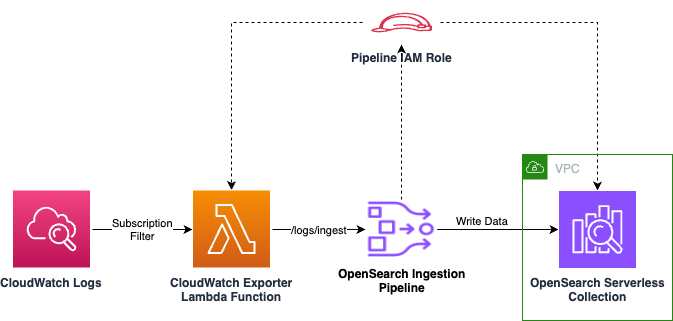

## Amazon OpenSearch Ingestion

## <!--BEGIN STABILITY BANNER-->


> **This is a stable example. It should successfully build out of the box**
>
> This example is built on Construct Libraries marked "Stable" and does not have any infrastructure prerequisites to build.

---

<!--END STABILITY BANNER-->

## Overview

[Amazon OpenSearch Ingestion](https://docs.aws.amazon.com/opensearch-service/latest/developerguide/ingestion.html) is a fully managed, serverless data collector that delivers real-time log, metric, and trace data to [Amazon OpenSearch Service domains](https://docs.aws.amazon.com/opensearch-service/latest/developerguide/what-is.html) and [Amazon OpenSearch Serverless collections](https://docs.aws.amazon.com/opensearch-service/latest/developerguide/serverless.html).

In this example, we show how to use the [AWS Cloud Development Kit (CDK)](https://docs.aws.amazon.com/cdk/v2/guide/home.html) to set up an Amazon OpenSearch Ingestion Pipeline to ingest CloudWatch logs using a [CloudWatch subscription filter]() and write to Amazon OpenSearch Serverless collection in an [Amazon Virtual Private Cloud (VPC)](https://aws.amazon.com/vpc/). The pipeline is setup to receive log events on `/logs/ingest` path using the OpenSearch Ingestion pipeline API endpoint. 


_figure1.Architecture Diagram of loading CloudWatch logs into an OpenSearch Serverless collection using an OpenSearch Ingestion pipeline_

The CDK stack sets up roles and permissions to enable all of the services to communicate with one-another. It further provides access for the deploying user's IAM identity. Finally, the stack sets up a VPC, and creates a VPC endpoint for communication to OpenSearch Serverless (see below for configuration).

### Configuration of the code

To configure the solution for your account, visit [cwlogs_ingestion_stack](./cwlogs_ingestion/bin/cwlogs_ingestion_stack.ts). There are 2 stacks that are created here:
- `OpenSearchSetupStack`
- `CWLogsSubscriptionStack`

You can modify the names of the resources in `OpenSearchSetupStack` stack. Below are default values:

```
STACK_NAMING_PREFIX = 'cw-to-os'

STACK_RESOURCE_NAMING_PREFIX = 'OpenSearchSetup'

COLLECTION_NAME = '${this.STACK_NAMING_PREFIX}-col'
PIPELINE_NAME = '${this.STACK_NAMING_PREFIX}-pipe'
NETWORK_POLICY_NAME = '${this.STACK_NAMING_PREFIX}-net-pol'
ENCRYPTION_POLICY_NAME = '${this.STACK_NAMING_PREFIX}-enc-pol'
DATA_ACCESS_POLICY_NAME = '${this.STACK_NAMING_PREFIX}-data-pol'
```

For, `CWLogsSubscriptionStack` stack, visit [cwlogs_subscription_stack](./cwlogs_ingestion/lib/cwlogs_subscription_stack.ts). This stack deploys the following resources:

- `CWLogsSubscriptionLogEmitter` lambda to publish logs to CloudWatch which is invoked every 5 minutes triggered using an EventBridge timer. 
- Lambda Subscription Filter for CloudWatch logs published by the `CWLogsSubscriptionLogEmitter` lambda resource

To view data in your OpenSearch Serverless Collection navigate to the Amazon OpenSearch Service console. In the left navigation pane click the reveal triangle if it's not already open. Click **Collections**. Click **cw-to-os-col** (or find your **COLLECTION_NAME** if you changed it). Scroll down until you see the **Endpoint** section, and click the URL under **OpenSearch Dashboards URL**. This will launch OpenSearch Dashboards.

In OpenSearch Dashboards, dismiss the initial splash screen. In the upper right, find the **Manage** link, and click it. Click **Index Patterns** in the left navigation pane. Click **Create index pattern**. and type `ddb-to-aoss-*` into the **Index pattern name** text box. Click **Next step**. Drop down the **Time field** menu, and select `@timestamp`. Click **Create index pattern**.

## Build and Deploy

The `cdk.json` file tells the CDK Toolkit how to execute your app.

## Synthesize Cloudformation Template

To see the Cloudformation template generated by the CDK, run `cdk synth`, then check the output file in the "cdk.out" directory.

## Deploy

- Run `cdk deploy OpenSearchSetupStack` to deploy OpenSearch Serverless collection, OpenSearch Ingestion Pipeline resources to your personal account.
- Run `cdk deploy CWLogsSubscriptionStack` to deploy CloudWatch logs subscription filter lambda resources to your personal account.

## CDK Destroy

If no longer want the stack to be running, you can destroy the stack by running `cdk destroy`
