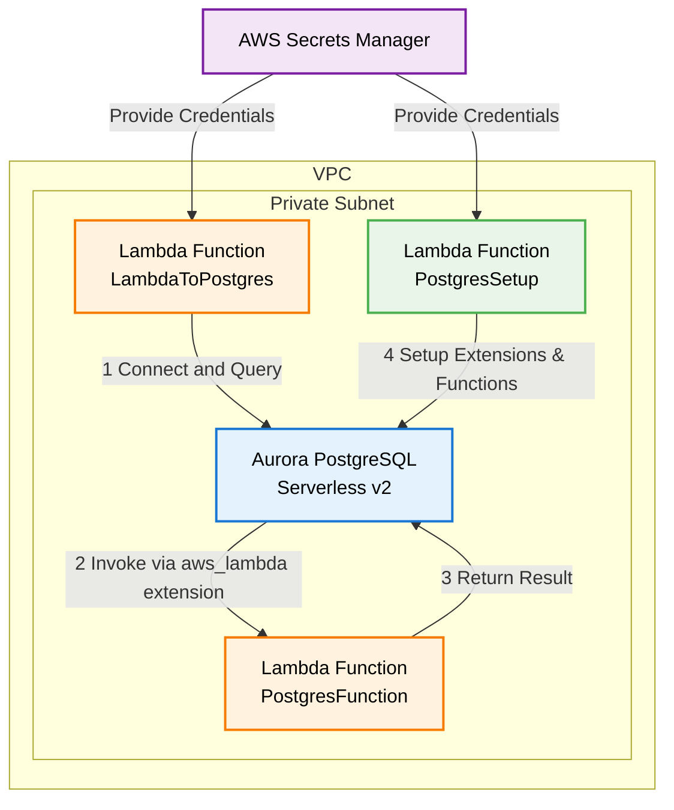

# PostgreSQL and Lambda Integration Example

A complete AWS CDK example demonstrating bidirectional integration between Aurora PostgreSQL Serverless v2 and AWS Lambda functions.

## What This Example Demonstrates

- **Lambda → PostgreSQL**: Lambda function that connects to and queries PostgreSQL
- **PostgreSQL → Lambda**: PostgreSQL database that invokes Lambda functions using the `aws_lambda` extension
- **Secure Architecture**: Private subnets, IAM roles, and Secrets Manager integration
- **Production-Ready**: Includes error handling, connection pooling, and security best practices
- **Automated Setup**: Custom CDK resource automatically configures PostgreSQL extensions and functions
- **Yarn Workspaces**: Organized monorepo structure for managing multiple Lambda functions

## Architecture



**Components:**
- Aurora PostgreSQL Serverless v2 cluster (private subnet)
- Lambda function for database operations (`LambdaToPostgres`)
- Lambda function invokable from PostgreSQL (`PostgresFunction`)
- Lambda function for automated setup (`PostgresSetupFunction`)
- IAM roles with least-privilege permissions
- Security groups for network access control
- AWS Secrets Manager for credential storage
- Custom CDK resource for automated PostgreSQL configuration

## Quick Start

### Prerequisites

- AWS CDK v2 installed (`npm install -g aws-cdk`)
- Node.js 18.x or later
- Yarn package manager installed
- AWS CLI configured with appropriate credentials

### Deploy

```bash
# Install dependencies using yarn workspaces
yarn install

# Deploy the stack (setup is now automated!)
yarn cdk deploy
```

The deployment will automatically:
- Create the Aurora PostgreSQL cluster
- Deploy all Lambda functions
- Configure PostgreSQL extensions and functions
- Set up all necessary permissions

No manual setup required! 🎉

## Testing

### Test Lambda → PostgreSQL

Using AWS CLI directly:
```bash
aws lambda invoke \
  --function-name <LAMBDA_TO_POSTGRES_FUNCTION_NAME> \
  --payload '{"message": "Hello from CLI!"}' \
  response.json && cat response.json
```

### Test PostgreSQL → Lambda

Connect to PostgreSQL and test the functions:
```bash
psql -h <DB_CLUSTER_ENDPOINT> -U postgres -d demodb
```

```sql
-- Test the PostgreSQL to Lambda integration
SELECT process_data('{"id": 123, "value": "test"}'::JSONB);
SELECT transform_data('{"id": 456, "value": "hello world"}'::JSONB);
SELECT validate_data('{"id": 789, "value": "valid data"}'::JSONB);
```

## How It Works

### Automated Setup Process

1. **CDK Deployment**: Stack creates all resources including a setup Lambda function
2. **Custom Resource**: Triggers the setup Lambda after database is ready
3. **Extension Installation**: Setup function creates the `aws_lambda` extension
4. **Function Creation**: Creates SQL functions that wrap Lambda invocations
5. **Ready to Use**: Database is immediately ready for bidirectional Lambda integration

### Lambda to PostgreSQL Flow

1. **Credential Retrieval**: Function retrieves DB credentials from Secrets Manager
2. **Connection**: Establishes secure SSL connection to PostgreSQL
3. **Table Management**: Creates demo table if it doesn't exist
4. **Data Operations**: Inserts message and queries recent records
5. **Response**: Returns formatted results with error handling

### PostgreSQL to Lambda Flow

1. **Extension Setup**: Uses `aws_lambda` extension for Lambda invocation (automated)
2. **Function Creation**: SQL functions wrap Lambda calls with proper ARN construction (automated)
3. **Synchronous Invocation**: Uses 'RequestResponse' invocation type for immediate results
4. **Event Processing**: Lambda receives structured JSON events from PostgreSQL
5. **Result Return**: Lambda response becomes available in SQL query results

## Project Structure

```
├── bin/                    # CDK app entry point
├── lib/                    # CDK stack definition
├── lambda/                 # Lambda function source code
│   ├── lambda-to-postgres/ # Lambda that calls PostgreSQL
│   ├── postgres-to-lambda/ # Lambda called by PostgreSQL
│   └── postgres-setup/     # Lambda for automated setup
├── test/                   # Unit tests
└── README.md              # This file
```

## Yarn Workspaces

This project uses Yarn Workspaces to manage multiple packages in a monorepo structure:

```bash
# List all workspaces
yarn workspaces info

# Run a command in a specific workspace
yarn workspace postgres-to-lambda run <command>

# Install dependencies for all workspaces
yarn install
```

The workspace structure allows for:
- Shared dependencies between packages
- Individual package management
- Simplified build and deployment process
- Better organization of Lambda functions

## Configuration

### Environment Variables

The Lambda functions use these environment variables (set automatically by CDK):

- `DB_SECRET_ARN`: ARN of the database credentials secret
- `DB_NAME`: Database name (default: `demodb`)
- `POSTGRES_FUNCTION_NAME`: Name of the Lambda function called by PostgreSQL
- `AWS_REGION`: AWS region for Lambda ARN construction

### Customization

- **Database Configuration**: Modify `lib/postgres-lambda-stack.ts`
- **Lambda Logic**: Update files in `lambda/` directories
- **Setup SQL**: Customize `lambda/postgres-setup/index.js`

## Security Features

✅ **Network Security**
- Database in private subnets
- Security groups with minimal required access
- No direct internet access to database

✅ **Access Control**
- IAM roles with least-privilege permissions
- Secrets Manager for credential storage
- SSL/TLS encryption for database connections

✅ **Monitoring**
- CloudWatch logs for all Lambda functions
- Database performance insights available
- VPC Flow Logs (can be enabled)

## Production Considerations

Before using in production:

- [ ] Enable SSL certificate validation (`rejectUnauthorized: true`)
- [ ] Implement connection pooling (consider RDS Proxy)
- [ ] Set up proper monitoring and alerting
- [ ] Configure backup and disaster recovery
- [ ] Review and tighten IAM policies
- [ ] Enable database encryption at rest
- [ ] Set up VPC endpoints for AWS services
- [ ] Implement proper error handling and retry logic

## Troubleshooting

### Common Issues

**Connection Timeouts**
- Check security group rules
- Verify Lambda is in correct VPC/subnets
- Confirm database is running

**Permission Errors**
- Verify IAM roles have required permissions
- Check Secrets Manager access
- Confirm Lambda execution role

**Setup Function Issues**
- Check CloudWatch logs for the PostgresSetupFunction
- Verify custom resource completed successfully
- Ensure database is accessible from setup Lambda

### Useful Commands

```bash
# Build all packages
yarn build

# Build only Lambda functions
yarn build:lambda

# Build and watch for changes
yarn watch

# Run tests
yarn test

# View CloudFormation template
yarn cdk synth

# Compare deployed vs current state
yarn cdk diff

# View stack outputs
aws cloudformation describe-stacks --stack-name PostgresLambdaStack --query 'Stacks[0].Outputs'

# Check setup function logs
aws logs describe-log-groups --log-group-name-prefix /aws/lambda/PostgresLambdaStack-PostgresSetupFunction
```

## Cleanup

```bash
yarn cdk destroy
```

**Note**: This will delete all resources including the database and any data stored in it.

## Cost Optimization

- Aurora Serverless v2 scales to zero when not in use
- Lambda functions only charge for execution time
- Setup function runs only once during deployment
- Consider Reserved Capacity for consistent workloads
- Monitor usage with AWS Cost Explorer

## Related Examples

- [Lambda with RDS Proxy](../lambda-rds-proxy/)
- [Aurora Serverless v1](../aurora-serverless-v1/)
- [PostgreSQL with CDK](../postgresql-cdk/)

## Contributing

1. Fork the repository
2. Create a feature branch
3. Make your changes
4. Add tests if applicable
5. Submit a pull request

## License

This example is provided under the MIT-0 License. See the LICENSE file for details.
