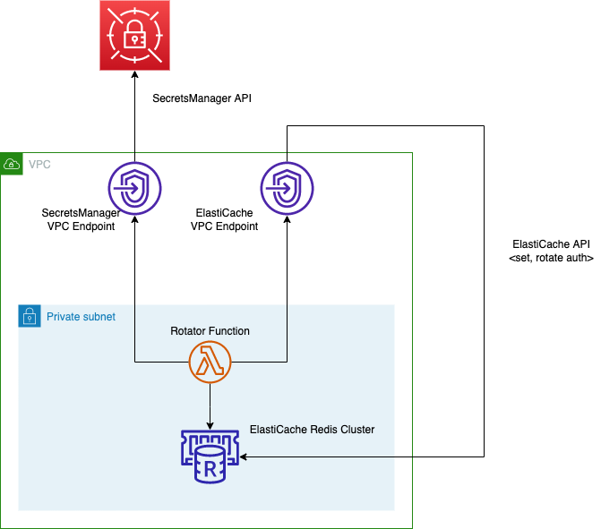
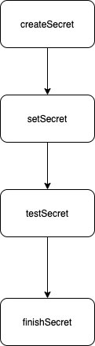

# ElastiCache Redis Auth Rotation with Secrets Manager

<!--BEGIN STABILITY BANNER-->
---


> **This is an experimental example. It may not build out of the box**
>
> This example is built on Construct Libraries marked "Developer Preview" and may not be updated for latest breaking changes.
>
> It may additionally requires infrastructure prerequisites that must be created before successful build.
>
> Non-core construct in preview used in this example: [`@aws-cdk/aws-lambda-python-alpha`](https://docs.aws.amazon.com/cdk/api/v2/docs/aws-lambda-python-alpha-readme.html)
>
> If build is unsuccessful, please create an [issue](https://github.com/aws-samples/aws-cdk-examples/issues/new) so that we may debug the problem
---
<!--END STABILITY BANNER-->

The example will create an secret in AWS SecretsManager that will be used as the auth token in the ElastiCache Redis replication group. The secret will have a rotation policy defined and a custom Lambda function that will be called whenever the secret needs to be rotated.

## Architecture

This example deploys:
* A VPC with one, private isolated subnet (without internet access)
* A SecretsManager VPC interface endpoint is deployed to allow the rotator function to make API calls to Secrets Manager tor rotate secrets without traversing the internet
* An ElastiCache VPC interface endpoint is deployed to allow the rotator function to make API calls to set the Auth password without traversing the internet
* An AWS SecretsManager secret to be used as an auth token in Amazon ElastiCache Redis
* An Amazon ElastiCache Redis replication group in the private subnet
* A Lambda function in the private subnet used for secret rotation. [_Learn more about how to use the Rotation Function._](#Rotation-Function)



## Setup

You'll need to create a credentials or config file and install the cdk tools.

### Create/Modify an AWS Config or Credentials file

Follow the [prerequisites](https://docs.aws.amazon.com/cdk/latest/guide/getting_started.html#getting_started_prerequisites) to setup your computer to connect to an AWS account.

You also may optionally install the AWS CLI by following the instructions [here](https://docs.aws.amazon.com/cli/latest/userguide/cli-chap-install.html).

### Install CDK Tools

You can install the CDK toolkit with the Node Package Manager by running the following command in your terminal:

```sh
npm install -g aws-cdk
```
### Install Docker Desktop or Docker Engine

This example uses the [aws-lambda-python-alpha](https://docs.aws.amazon.com/cdk/api/v2/docs/aws-lambda-python-alpha-readme.html) library to build a Lambda layer with redisPy installed. In order for aws-lambda-python-alpha to work however, you must have Docker Desktop or Docker Engine installed and running in your development environment when synthing or deploying this code. Installation instructions for Docker Desktop (preferable for Mac and Windows) can be found [here](https://docs.docker.com/desktop/), while instructions to install Docker Engine can be found [here](https://docs.docker.com/engine/).

## Build

Before getting ready to deploy, ensure the dependencies are installed by executing the following:

```sh
npm install
npm run build
```

## Deployment

Deploy the stack by calling

```sh
cdk deploy
```

_Optionally, you can also specify ```--profile <profile_name>``` if you created a config file or credentials file._

## Testing

You can test secret rotation by manually triggering rotation via the AWS Secrets Manager console.


You can view the logs in CloudWatch.


## Useful commands

 * `npm run build`   compile typescript to js
 * `npm run watch`   watch for changes and compile
 * `npm run test`    perform the jest unit tests
 * `cdk deploy`      deploy this stack to your default AWS account/region
 * `cdk diff`        compare deployed stack with current state
 * `cdk synth`       emits the synthesized CloudFormation template

## Rotation Function

The secret will be configured with a rotation schedule and a custom rotator function (implemented in Python) that will rotate the auth token on the ElastiCache repolication group via the Boto3 library. The rotator function will use the redispy Python library to connect to Redis to validate that the auth token is rotated.

Details on how the rotation function works can be found [here](https://docs.aws.amazon.com/secretsmanager/latest/userguide/rotating-secrets-one-user-one-password.html).



### Create Secret

* Retrieve the AWSCURRENT version of the secret by using the GetSecretValue operation.

* Extract the protected secret text from the SecretString field, and store it in a structure you can modify.

* Generate a new password by using an algorithm to generate passwords with the maximum length and complexity requirements supported by the protected resource.

* Overwrite the password field in the structure with the new one you generated in the previous step. Keep all other details, such as username and the connection details the same.

* Store the modified copy of the secret structure by passing it as the SecretString parameter in a call to PutSecretValue. Secrets Manager labels the new version of the secret with AWSPENDING.


### Set Secret

* Retrieve the AWSPENDING version of the secret by using the GetSecretValue operation.

* Issue commands to the secured resource authentication system to change the existing user password to the one stored in the new AWSPENDING version of the secret.

```python
def is_cluster_available(service_client, clusterId):
  response = service_client.describe_replication_groups(
    ReplicationGroupId=os.environ['replicationGroupId']
  )
  status = response['ReplicationGroups'][0]['Status']

def set_secret(service_client, arn, token):
  ...
  # Loop until cluster is available
  while (not is_cluster_available(client, replicationGroupId)):
    time.sleep(3)

  service_client.get_secret_value(SecretId=arn, VersionStage="AWSCURRENT")

  response = client.modify_replication_group(
    ApplyImmediately=True,
    ReplicationGroupId=replicationGroupId,
    AuthToken=response['SecretString'],
    AuthTokenUpdateStrategy='ROTATE'
  )
```

### Test Secret

* Retrieve the AWSPENDING version of the secret by using the GetSecretValue operation.

* Issue commands to the secured resource to attempt to access it by using the credentials in the secret.

```python
def test_secret(service_client, arn, token):
  response = service_client.get_secret_value(SecretId=arn, VersionId=token, VersionStage="AWSPENDING")
  replicationGroupId = os.environ['replicationGroupId']
  try:
      # Attempt to connect to the redis cluster
      redis_server = redis.Redis(
          host=os.environ['redis_endpoint'],
          port=os.environ['redis_port'],
          password=response['SecretString'],
          ssl=True)

      response = redis_server.client_list()
      logger.info(response)
  except:
      logger.error("test: Unable to secret for %s." % arn)
      client = boto3.client('elasticache')

      # if we couldn't connect, then undo setting the ElastiCache auth from the previous step
      response = client.modify_replication_group(
        ApplyImmediately=True,
        ReplicationGroupId=replicationGroupId,
        AuthToken=response['SecretString'],

        AuthTokenUpdateStrategy='DELETE'
      )
  logger.info("test: Successfully tested secret for %s." % arn)
```


### Finalize Secret

* Move the label AWSCURRENT to the version labeled AWSPENDING. This automatically also moves the staging label AWSPREVIOUS to the secret you just removed AWSCURRENT from.

* (Optional) Remove the label AWSPENDING from its version of the secret.

```python
def finish_secret(service_client, arn, token):
  ...
  # Wait for the cluster to become available
  while (not is_cluster_available(client, replicationGroupId)):
    time.sleep(3)

  # Finalize by setting the auth token
  response = client.modify_replication_group(
    ApplyImmediately=True,
    ReplicationGroupId=replicationGroupId,
    AuthToken=response['SecretString'],
    AuthTokenUpdateStrategy='SET'
  )

  ...

  # Finalize by staging the secret version current
  service_client.update_secret_version_stage(SecretId=arn, VersionStage="AWSCURRENT", MoveToVersionId=token,  RemoveFromVersionId=current_version)

```
