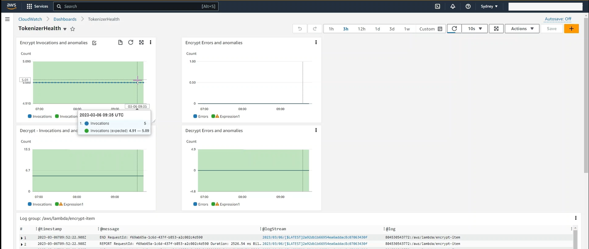

# Serverless multi-region tokenizer with data expiry

If you need to store sensitive data, one of the best ways is to replace the
sensitive data in your core database with a token, or lookup string. You then
store the sensitive data in an isolated, protected architecture - in essentially 
the same way as credit card data is stored.

A tokenizer can be used to protect:
* PCI data such as PANs (credit card numbers), CCVs, expiry dates
* Date of Birth (DOB)
* Social Security Numbers (SSNs)
* Driver's license numbers
* Passport numbers
* and more.

This project deploys a tokenizer to two regions in your AWS account. When you
provide sensitive data, the tokenizer encrypts the data and returns a token (GUID) 
which you then store.

Later, when you need the data, you provide the token, and the tokenizer looks up
the data, decrypts it, and returns it to you.

This architecture provides the following controls
* Amazon DynamoDB data is encrypted at rest
* DynamoDB items are encrypted using the DynamoDB encryption client,
    using multi-region customer-managed keys (CMK) provided by AWS KMS (Key Management Service)
* Each DynamoDB item uses a different encryption key
* DynamoDB is provisioned in multi-active, multi-region mode
* DynamoDB uses TTLs (Time-To-Live) to expire unwanted data as soon as it is no longer required
* DynamoDB is accessed via a AWS VPC Private endpoint
* KMS for key management is accessed via a VPC interface
* AWS Lambdas and KMS are attached to Security Groups that limit access
* AWS API Gateway controls access to Lambda functions, with rate limiting and authorisation
    (via Cognito or other)
* VPCs and private subnets prevent access to Lambdas
* Lambda getters and setters are separate, with separate minimum privilege security roles 
    for accessing DynamoDB for read and KMS for decryption, and
    for writing to DynamoDB for write and KMS for encryption

# Architecture


Note - this image has embedded markup that you can re-use by importing into Draw.io.

# Sample use case

A sample use case is for PCI-DSS payment card data.

The Payment Card Industry Data Security Standard (PCI DSS) is an information security standard 
for organizations that handle branded credit cards from the major card schemes. In essence,
credit card information is stored securely in one place with very limited access. Other systems refer
to it through the use of a token (or label). When a payment is required, the token is swapped for the
actual credit card information temporarily so that it can be presented to a payment gateway.

The sample can be used to get and set PCI data. Your next step would be to write a lambda to
call the payment gateway from within the VPC. This lambda would retrieve the encrypted data using the token, and then 
present the information to the payment gateway, and return the response to the consumer. You may 
even decide to use different payment gateways depending on the card type.

* Note that PCI-DSS requires more than just shifting PAN data to another system. The systems
that get and set the PAN data need to be separate from each other (as in the gateway access example), 
otherwise you're just creating needless work without changing compliance meaningfully. Speak to a 
PCI-DSS auditor or specialist for advice.


# Observability

For this architecture, we need to monitor the behaviour of the encryption and decryption Lambdas.
The constant access of read and write have been established using Amazon EventBridge Scheduler events
as detailed in the testing section. This sets up a baseline for reporting on anomalies. In 
production use, reads and writes will vary throughout the day, week and year, and the AI/ML
behind the anomaly reporting will build these variations into the model. 




# Testing

For a quick test, you can [insert data using the Lambda console](https://ap-southeast-2.console.aws.amazon.com/lambda/home?region=ap-southeast-2#/functions/encrypt-item?tab=testing)

and the following JSON test event (remember to update the TTL to a future data using https://www.epochconverter.com/ to find an Unix epoch date in the future):
```
{
	"data": {
		"drivers_license": "987654321",
        "medicare_card": "1234 56789 0",
        "tax_file_number": "111 111 111",
		"TTL": 1749865423
	}
}
```

When you run the Lambda with this event, you should get a response similar to shown below, with a tokenId
showing which region created the token (SYD/SIN), with a TKN prefix which is a useful
indicator in your main database that this field value is a token:
```
{
	"tokenId": "TKN-SYD-4b30f90b-d478-4e4d-8b8d-96e34522f553"
}
```

If you then [inspect the DynamoDB table using the console](https://ap-southeast-2.console.aws.amazon.com/dynamodbv2/home?region=ap-southeast-2#item-explorer?maximize=true&operation=SCAN&table=sensitive-data)

You should see the freshly added item, with all data fields encrypted (if you don't see data, check your TTL is in the future)
```
{
  "tokenId": {
    "S": "TKN-SYD-4b30f90b-d478-4e4d-8b8d-96e34522f553"
  },
  "*amzn-ddb-map-desc*": {
    "B": "AAAAAAAAABBhbXpuLWRkYi1lbnYtY...A9hd3Mta21zLWVjLWF0dHIAAAAGKmtleXMq"
  },
  "*amzn-ddb-map-sig*": {
    "B": "l1pg5bhTsz9USfgoO7N+/hMpVxXDRG1D+jx106L/el4="
  },
  "drivers_license": {
    "B": "z47eF/0AH4InDdGq/n3QUW2DqZXGuT0IUFwoGAJXXmY="
  },
  "medicare_card": {
    "B": "ba3sVUY7bsQwhh1g4K2uDOT+C0/TpwZC25fY2xhNLnFZ/rt03mOxkNVjhr2Ca7np"
  },
  "tax_file_number": {
    "B": "XawH0WzfN7lOmdjMd278Pa5xtwYlbjxIhT7v3++mBSKddRTNGg708aQUmYSfOhfj"
  },
  "TTL": {
    "N": "1749865423"
  }
}
```

You can also [test the decryption lambda using the console](https://ap-southeast-2.console.aws.amazon.com/lambda/home?region=ap-southeast-2#/functions/decrypt-item?tab=testing)

and a JSON test event like this (ensure you update the tokenId from above):
```
{
  "tokenId": "TKN-SYD-4b30f90b-d478-4e4d-8b8d-96e34522f553"
}
```

This will return the original unencrypted data. It doesn't matter if you use the API in the 
primary or secondary region - as the KMS key has been replicated to both regions.

# Security Anomaly Detection

With Amazon CloudWatch dashboards you can easily show the rate of successful and failed 
read and writes. You can also easily detect anomalies in these access patterns which may
indicate that an unauthorised third party is attempting to read data or is accessing data
at scale. Anomalies can send events to Amazon SNS, which can be connected to email, Slack or
other alerting solutions.

## Testing Anomaly Detection and Observability

You can use an EventBridge Scheduled Event to insert new data every minute using the JSON event
above, and a second EventBridge Scheduled Event to retrieve a known record every minute, using the 
sample JSON event above. Leave these running for 3 hours to set up a baseline pattern of activity.

Next setup your CloudWatch anomaly detection on successful and unsuccessful decryption calls.

Using a AWS CloudShell or AWS Cloud9 console, you can see how the architecture responds to anomalous access 
patterns using the following scripts:

```
# run in a loop - request known record
for i in {1..100}; do echo -n "This is a GET of known data in loop $i "; date ; aws lambda invoke \
--function-name decrypt-item \
--cli-binary-format raw-in-base64-out \
--payload '{ "tokenId": "TKNccf079c1-91f0-4f3c-93a8-4851bef7fdbb" }' \
outfile.json; cat outfile.json; done

```

```
# ask for a non-existent tokenId to raise errors
for i in {1..100}; do echo -n "This is a GET on non-existent data in loop $i "; date ; aws lambda invoke \
--function-name decrypt-item \
--cli-binary-format raw-in-base64-out \
--payload '{ "tokenId": "zzzz" }' \
outfile.json; cat outfile.json;  done
```

For security observability, we are going to focus on monitoring decryption events. Testing with the sample
scripts above show just how sensitive the anomaly detection can be with regard to detecting a change in
the number of both successful and unsuccessful decryption events:


These changes are then connected to SNS to alert the user via email, Slack, etc.


# Considerations before using for production

This is a sample architecture, deliberately simplified for demonstration purposes.
Before using this architecture for production data, you will need to consider the
following areas at a minimum:
* Decide if the architecture needs to be exposed privately or publically (e.g. for an App)
* Add an authorizer to the API Gateways to control access, such as AWS Cognito
* Add a WAF to protect the API Gateways from DDoS attacks, such as AWS WAF
* Add VPC-level protections, such as VPC peering or AWS Transit Gateway to consuming accounts
* Enable Network level protections such as VPC Flow logs 
* Add Account-level protections such as an isolated account strategy, MFA, alert on login
* Connect CloudTrail logging to your SIEM (Security Information and Event Management) platform

KMS has a limit of 5,500 transactions or higher per second, depending on which regions you
deploy to, see https://docs.aws.amazon.com/kms/latest/developerguide/requests-per-second.html 

For more information on Best Practices for Security, Identity, & Compliance, please see 
  https://aws.amazon.com/architecture/security-identity-compliance


# Manual Installation Steps; Parameters

## Domain for API Gateway

You need to host the API Gateway on a domain, so you need to create a hosted zone first
with Amazon Route 53, and set the value in Constants.ts\myDomainName.

## Customer Master Key

You also need to use AWS KMS to manually create a multi-region customer master key (CMK), 
and ask for it to be replicated to the regions you deploy the architecture to. See


* https://ap-southeast-2.console.aws.amazon.com/kms/home?region=ap-southeast-2#/kms/keys/create (or choose another region)
* Key type: Symmetric
* Key usage: Encrypt and Decrypt
* Regionality: Multi-Region key.

Once the key is created, you can then replicate it to desired regions:


## Constants you can control

Change constants.ts to set 
* ddbTokenTable - the name of the DynamoDB table to create - default sensitive-data
* homeRegion - the AWS region where the primary architecture is deployed - default Sydney
* replicaRegion - the AWS region where the secondary architecture is deployed - default Singapore
* myDomainName - the root domain name - if not provided the APIGW will not be created
* myApiSubdomain - the subdomain used by the api e.g. 'api' - if not provided the APIGW will not be created
* kmsMultiRegionKeyAlias - the alias of the multi-region customer master key. If you don't provide the alias, the Lambdas won't be able to access the key for encryption or decryption
* kmsMultiRegionKeyId - the id (not ARN) of the multi-region customer master key


# Installation

You need to manually install
* Docker
* Node and npm
* Python
* Typescript


## First install AWS CDK
$ npm install -g aws-cdk

## Clone the repo locally:
$ git clone https://github.com/aws/aws-samples/cdk/.....


## Install dependencies
$ npm install

## Prepare AWS environment for CDK in Replica region
Use 'aws configure' to change the AWS access keys, account and region to where your REPLICA architecture will be created

$ aws configure
$ cdk bootstrap

## Prepare AWS environment for CDK in Primary region
Use 'aws configure' to change the AWS region to where your HOME (primary) architecture will be created, and run

$ aws configure
$ cdk bootstrap

## Generate the stacks from the CDK code
$ cdk synth

## Get local login credentials for ECR (Elastic Container Registry)

You need to have docker installed and the docker daemon running first.
The region below will be your primary AWS region.

Run this:
$ aws ecr get-login-password --region <region> | docker login --username AWS --password-stdin <aws_account_id>.dkr.ecr.<region>.amazonaws.com

e.g.
$ aws ecr get-login-password --region ap-southeast-2 | docker login --username AWS --password-stdin 111111111111.dkr.ecr.ap-southeast-2.amazonaws.com


## Deploy all the stacks
$ cdk deploy --all --require-approval=never

## Updating the code
To update the Python code in the Lambdas, you can re-deploy just the changed component. Because the Python 
code uses an encryption library that is binary, we've use CDK to generate a new Docker container. This happens
at deploy time rather than at 'cdk synth' time.  

$ cdk deploy Tokenizer-Sydney Tokenizer-Singapore

## To dispose of the stacks afterwards

$ cdk destroy --all --require-approval=never


# About CDK

This section contains all the CDK code examples written in Typescript. For more information on using the CDK in Typescript, please see the Developer Guide.

## Useful commands

* `npm run build`   compile typescript to js
* `npm run watch`   watch for changes and compile
* `npm run test`    perform the jest unit tests
* `cdk deploy`      deploy this stack to your default AWS account/region
* `cdk diff`        compare deployed stack with current state
* `cdk synth`       emits the synthesized CloudFormation template
