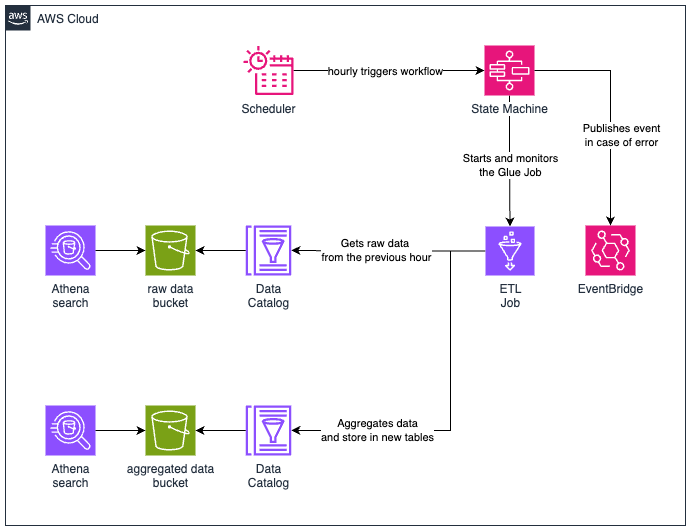

# demo-glue-scheduled-aggregators

## Project Overview

This project aims to implement a scalable and robust architecture capable of processing data on an hourly basis,
analyzing the information pertaining to the preceding hour.

The input data is stored in a _S3_ bucket and accessed by a _Glue Data Catalog_, in a **json** format considered as
*raw data*. The process should collect the data pertaining to the preceding hour and aggregate it in 3 different ways.
The aggregated data is also stored in a _S3_ bucket and equally accessible through a _Glue Data Catalog_. The aggregated
data is then stored in different formats like **json** and **parquet**.

For this project, we're working with data on webpage hits. The aggregation process will result in a count of page hits
per hour, categorized by fields like Domain and Country.

## Architecture

The architecture consists of the following components:

1. A _S3 bucket_ to store both raw and aggregated data.
2. _Glue Data Catalogs_ to store the metadata related to the data repositories.
3. An _EventBridge Schedule_ to hourly trigger the ETL workflow.
4. A _Step Functions State Machine_ to orchestrate the ETL workflow.
5. A _Glue Job_ responsible for the ETL process, aggregating the data into the final tables.
6. Whenever there is any problem during the ETL process, an event is sent to an _EventBust_ that can then notify any
   interested part.
7. _Athena_ can be used to query the data using the Data Catalog for reference.



## ETL Workflow

1. The ETL job starts by using a _Lambda Function_ to decrease 1 hour from the date-time received from the Scheduler. (
   This ETL job is intended to process the data related to the preceding hour).
2. The target date-time to process is then sent to the _Glue ETL Job_ to the processed.
3. Based on the _Glue ETL Job_ result:
    1. If the status indicates a failure, the result is formated and an event is published to the _EventBus_ to notify
       others.
    2. If the status indicates a success in the process, the workflow ends with a Success state.


## Deployment Guide

### Prerequisites

- AWS CLI installed and configured with appropriate IAM permissions
- NodeJS installed (version 22.4 or later)
- AWS CDK installed (version 2.149 or later)

### CDK Toolkit

The `cdk.json` file tells the CDK Toolkit how to execute your app.

To start working with the project, first you will need to install all dependencies as well as the cdk module (if not
installed already). In the project directory, run:

```bash
$ npm install
```

### Deploying the solution

To deploy the solution, we will need to request cdk to deploy the stacks:

```shell
$ cdk deploy --all
```

> **Note**: After the deployment is done, it will automatically trigger the workflow to start the ETL process, aiming to
> process the demo data deployed to the S3 bucket. Go to the `Testing the solution` section to check how you can access
> the resultant data.

> **Note**: After the deployment is done, some output data is presented on the terminal like the S3 bucket name, Job
> name and State Machine name.

## Testing the solution

1. Head to _AWS_ console and then to _Amazon Athena_
2. On the left panel, go to **Query editor**
3. On **Data source**, choose `AwsDataCatalog`
4. On **Database**, choose `demo-aggregated-data`
5. Three tables will be presented on the Table list: `hits_by_country`, `hits_by_domain_and_groupid`
   and `hits_by_useragent`, each one representing a different aggregation
6. You can then query the data on each one, as they may have been generated by the cdk scripts and ETL run:
    1. `SELECT * FROM "demo-aggregated-data"."hits_by_country";`
    2. `SELECT * FROM "demo-aggregated-data"."hits_by_domain_and_groupid";`
    3. `SELECT * FROM "demo-aggregated-data"."hits_by_useragent";`
7. You can also query the raw data by changing the **Database** to `demo-raw-data` and performing a query
   like `SELECT * FROM "demo-raw-data"."raw_data" limit 10;`
8. In addition, you can create new raw-data files to be processed by the ETL job inside the bucket shown on the CDK
   output. To do so, you have to follow the directory structure of `/year=<YEAR>/month=<MONTH>/day=<DAY>/hour=<HOUR>
   /minute=<MINUTE>` and the following multiline json schema:

```json
{
  "GroupID": number,
  "CountryCode": string,
  "UserAgent": string,
  "Language": string,
  "Domain": string,
  "Timestamp": datetime
}
```

9. Then you can run the _State Machine_, passing the following json as the input. Remember to add 1 hour to the
   date-time
   you want the ETL job to process:

```json
{
  "target_datetime": datetime
}
```

## Cleanup

To destroy the provisioned infrastructure, you can simply run the following command:

```shell
$ cdk destroy --all
```
